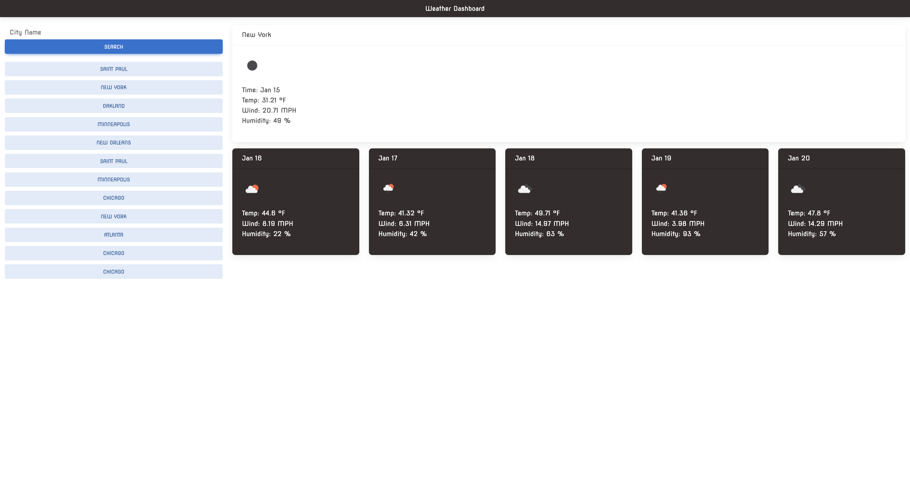

# Weather Dashboard App

[Weather Dashboard App](https://eshushango.github.io/weather-forecast-app/)

## Description

A simple weather dashboard that will run in the browser !

## My Task

Third-party APIs allow developers to access their data and functionality by making requests with specific parameters to a URL. Developers are often tasked with retrieving data from another application's API and using it in the context of their own. Your challenge is to build a weather dashboard that will run in the browser and feature dynamically updated HTML and CSS.

## What I Learned

- You can't use arrow functions for every func lol, there more useful 
in a Scope situation
- API's are interesting in a way and how we use them to "talk" to one another
is cool
- Walking through the logical steps with psuedo code is 🔑 imo to 
understanding more of what actually needs to be done
- MDB 5 is great for getting started with UI

## RoadMap

- a reset button-icon 
- a timer displayed
- code can be more efficient 
- UI can be a little more "Spiced up" and interactive 

## Sources

[https://github.com/nucleargriff](https://github.com/nucleargriff)

[https://chat.openai.com/chat](https://chat.openai.com/chat)
